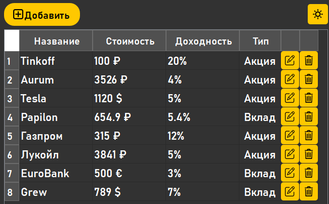
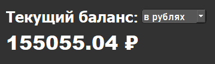
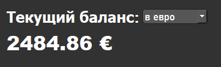
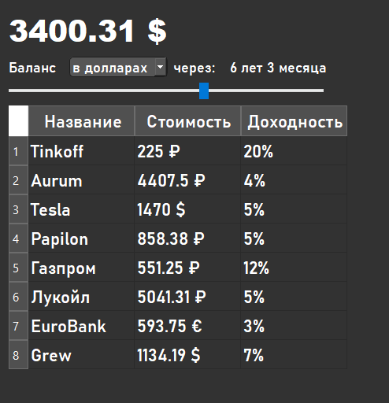

# ***InvestCalc***
### *Простой и надежный калькулятор ваших инвестиций*
___
Этот проект предназначен для тех, кто хочет следить за своим инвестиционным портфелем.
Теперь они смогут взглянуть на свои активы в целом и узнать прогноз на ближайшее время.
___
## Как запустить:
### 1 способ
- установить python  с [официального сайта](https://www.python.org/)
- установить зависимости из файла requirements.txt\
`pip install -r requirements.txt'`
- запустить файл main.py\
`python main.py`
### 2 способ
- перейти по пути до .exe файла\
`/.dist/main.exe`
___
## Что дальше?
- Когда запустите приложение, можете выбрать удобную вам тему с помощью
кнопки 
- Воспользуйтесь кнопкой "Добавить", чтобы добавить активы в таблицу,
верно заполнив все поля формы.
Тут же свои записи можно изменить и удалить.

  
- На главном экране видно все ваши активы и общий баланс.\
\
Можно поменять валюту, и значение баланса изменится по текущему курсу.\

- После нажатия на кнопку "Посмотреть прогноз" откроется окно с
возможностью перемещать ползунок, отвечающий за временную шкалу.
Подвигайте его и заметьте, как поменялся ваш итоговый баланс.

---
### Надеюсь, что пользование приложением принесёт сам удовольствие и станет удобным способом следить за своими финансами!
